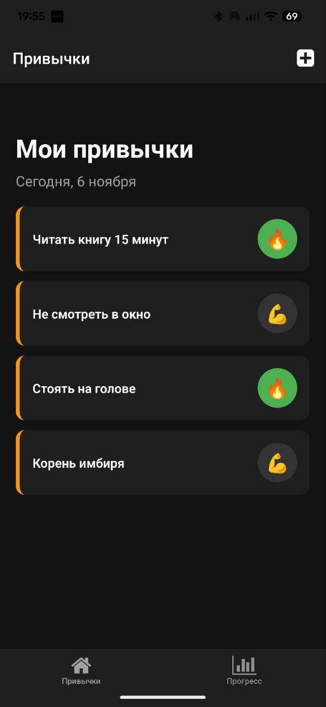
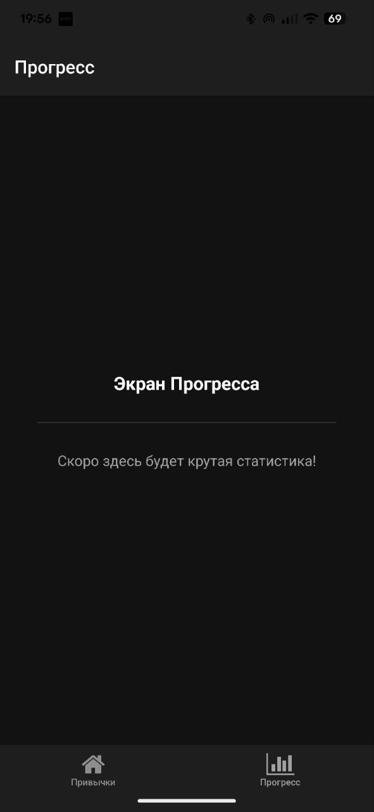
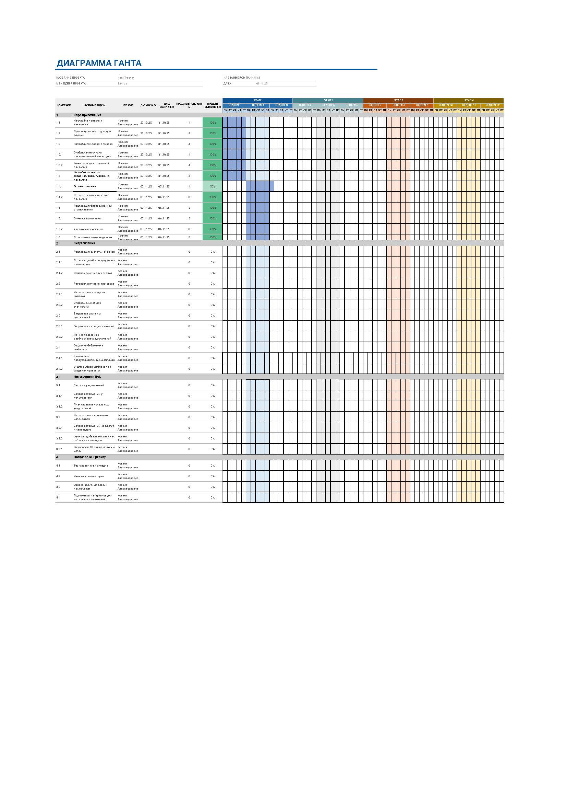
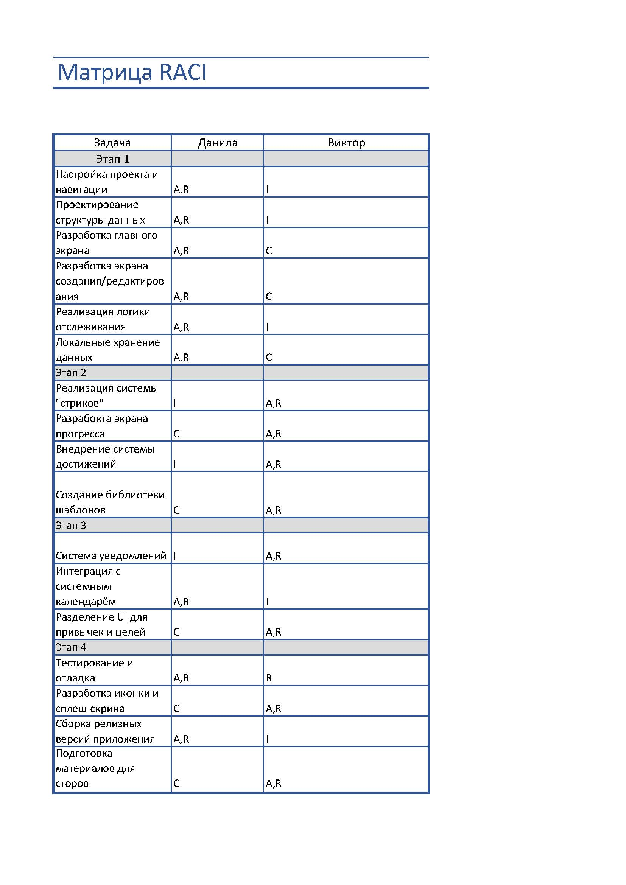

# Паспорт проекта (Project Charter)

**Название проекта:** Мобильное приложение "Habit Tracker"

**Дата создания:** 01.11.2025

---

### 1. Краткое описание проекта

Наш проект направлен на то, чтобы создать **мобильное приложение для отслеживания привычек и достижения целей**, которое поможет активным молодым людям решить проблему **с отсутствием системности и мотивации в формировании полезных рутин**, путём геймификации процесса, наглядной визуализации прогресса и интеграции в их цифровую жизнь.

---

### 2. Цели проекта по SMART

**Основная цель:**
Разработать и выпустить в **MVP (минимально жизнеспособный продукт) приложения "Habit Tracker"** к концу Q1 2025 года, который позволит пользователям создавать, отслеживать и анализировать свои привычки.

- **Specific (Конкретная):** Создать и запустить MVP приложения с ключевым функционалом (создание, отслеживание привычек, визуализация, мотивация).
- **Measurable:** Цель достигнута, когда приложение успешно проходит внутреннее тестирование, готово к загрузке в магазины и имеет все необходимые маркетинговые материалы.
- **Achievable (Достижимая):** Цели реалистичны для небольшого проекта с хорошим функционалом.
- **Relevant (Значимая):** Запуск MVP является критическим шагом для проверки гипотез, сбора обратной связи и дальнейшего развития продукта.
- **Time-bound (Ограниченная по времени):** Релиз до конца Q1 2025 года, оценка метрик в течение первого месяца после релиза.

---

### 3. Результаты проекта

**Материальные результаты:**

1.  **Исходный код проекта**, размещенный в системе GitHub.
2.  **Набор UI-ассетов** (иконка, сплэш-скрин, дизайн-макеты).
3.  **Документация для сторов** (описание, скриншоты, ключевые слова).

**Нематериальные результаты:**

1.  **Сформированная база первых пользователей** для получения обратной связи.
2.  **Полученный опыт командной разработки** мобильного приложения от идеи до реализации.

---

### 4. Бизнес-обоснование проекта

В настоящее время рынок приложений для повышения продуктивности и саморазвития показывает стабильный рост. Однако многие существующие решения либо слишком сложны и перегружены, либо слишком примитивны и лишены мотивационных элементов.

Реализация проекта "Habit Tracker" позволит занять нишу, ориентированную на молодую, технически подкованную аудиторию, которая ценит **геймификацию, социальное доказательство (ачивки) и простую, но мощную визуализацию**. Проект является проверкой гипотезы о том, что сочетание этих элементов способно обеспечить более высокий уровень удержания пользователей по сравнению с конкурентами. В долгосрочной перспективе успешный MVP станет основой для создания коммерчески успешного продукта с платными функциями.

---

### 5. Выгоды и затраты

**Выгоды:**

- **Прямые (потенциальные):** Создание приложиения.
- **Косвенные:**
  - Создание сильного проекта для портфолио участников команды.
  - Привлечение аудитории.
  - Развитие технических и продуктовых компетенций команды.

**Затраты:**

- **Временные:** Трудозатраты двух участников проекта на весь цикл разработки (приблизительно 3-4 месяца).
- **Финансовые:**
  - Стоимость аккаунтов разработчика (на этапе MVP - 0₽).
  - Потенциальные расходы на серверную инфраструктуру для будущих версий (на этапе MVP - 0₽).

---

### 6. Скоуп абот и управление проектом

**Скоуп работ:**
Реализация проекта подразумевает выполнение 4 ключевых этапов, описанных в WBS (Work Breakdown Structure). Объем работ включает в себя разработку на React Native, UI/UX дизайн, тестирование и подготовку к релизу.

**Команда проекта и зоны ответственности:**

- **Данила** Отвечает за всю техническую реализацию, архитектуру, принятие решений по продукту и управление проектом.
- **Виктор** Отвечает за визуальный дизайн, пользовательский опыт, создание графических ассетов и тестирование приложения на всех этапах.
  (Подробное распределение ответственности зафиксировано в **матрице RACI**).

**Основные принципы организации и управления:**

- **Методология:** Agile-подход с элементами Kanban. Задачи ведутся на доске.
- **Коммуникация:** Ежедневные короткие "созвоны" (5-10 минут) для синхронизации, регулярные сессии планирования и ретроспективы по завершении каждого крупного этапа.
- **Контроль версий:** Весь код хранится в Git-репозитории с использованием веток для новых фич (Feature Branch Workflow).
- **Принятие решений:** Ключевые продуктовые и технические решения принимает Lead Developer Данила Золотов после консультации с UI/UX Designer Данилой Золотовым.

---

# Habit Tracker - План разработки

## Статус проекта: В разработке

Проект в активной фазе разработки. Завершён **Этап 1 (Ядро приложения)**, что позволяет создавать, просматривать и отслеживать привычки с сохранением данных на устройстве.

---

### 📸 Скриншоты текущей версии (v0.1)

|                                Главный экран                                |                                    Создание привычки                                     |                               Экран прогресса                                |
| :-------------------------------------------------------------------------: | :--------------------------------------------------------------------------------------: | :--------------------------------------------------------------------------: |
|  |  |  |

### Дерево целей и задач (WBS)

### 🚀 Создать MVP приложения "Habit Tracker"

- [✅] **📦 Этап 1: Ядро приложения (Core Functionality)**

  - [✅] 1.1. Настройка проекта и навигации (E✅po, React Navigation)
  - [✅] 1.2. Проектирование структуры данных (модели для привычек, целей, прогресса)
  - [✅] 1.3. Разработка главного экрана (Dashboard)
    - [✅] 1.3.1. Отображение списка привычек/целей на сегодня
    - [✅] 1.3.2. Компонент для отдельной привычки (HabitItem)
  - [⚠️] 1.4. Разработка экрана создания/редактирования привычки
    - [❌] 1.4.1. Форма с полями (название, тип, частота, измеримость) - _Реализовано только поле "название"_
    - [✅] 1.4.2. Логика сохранения новой привычки
  - [✅] 1.5. Реализация базовой логики отслеживания
    - [✅] 1.5.1. Отметка выполнения (checkbo✅)
    - [✅] 1.5.2. Увеличение счётчика (counter)
  - [✅] 1.6. Локальное хранение данных (AsyncStorage)

- [ ] **✨ Этап 2: Визуализация и Мотивация**

  - [ ] 2.1. Реализация системы "стриков" (огонёк)
    - [ ] 2.1.1. Логика подсчёта непрерывных выполнений
    - [ ] 2.1.2. Отображение иконки стрика на главном экране
  - [ ] 2.2. Разработка экрана прогресса
    - [ ] 2.2.1. Интеграция календаря-графика (как на GitHub)
    - [ ] 2.2.2. Отображение общей статистики (процент выполнений и т.д.)
  - [ ] 2.3. Внедрение системы достижений (ачивки)
    - [ ] 2.3.1. Создание списка ачивок и условий их получения
    - [ ] 2.3.2. Логика проверки и разблокировки ачивок
  - [ ] 2.4. Создание библиотеки шаблонов
    - [ ] 2.4.1. Хранение предустановленных шаблонов
    - [ ] 2.4.2. UI для выбора шаблона при создании привычки

- [ ] **🔌 Этап 3: Интеграции и Улучшения (QoL - Quality of Life)**

  - [ ] 3.1. Система уведомлений
    - [ ] 3.1.1. Запрос разрешений у пользователя
    - [ ] 3.1.2. Планирование локальных уведомлений-напоминаний
  - [ ] 3.2. Интеграция с системным календарём
    - [ ] 3.2.1. Запрос разрешений на доступ к календарю
    - [ ] 3.2.2. Функция добавления цели как события в календарь
  - [ ] 3.3. Разделение UI для привычек и целей (табы, фильтры)

- [ ] **🏁 Этап 4: Подготовка к релизу**
  - [ ] 4.1. Тестирование и отладка (bug fixing)
  - [ ] 4.2. Разработка иконки и сплэш-скрина
  - [ ] 4.3. Сборка релизных версий приложения (Android .apk / iOS .ipa)
  - [ ] 4.4. Подготовка материалов для магазинов приложений (скриншоты, описание)

---

## 📊 Планирование и Управление Проектом

Этот раздел содержит ключевые документы по планированию и распределению ролей в проекте.

### Диаграмма Ганта

Диаграмма Ганта визуализирует график выполнения задач, их последовательность и сроки.

### Матрица ответственности (RACI)

Матрица RACI определяет роли и обязанности участников команды для каждой задачи проекта.

- **R (Responsible)** - Исполнитель: Тот, кто непосредственно выполняет работу.
- **A (Accountable)** - Ответственный: Тот, кто несет конечную ответственность за задачу и принимает решения.
- **C (Consulted)** - Консультант: Эксперт, с которым консультируются перед выполнением работы.
- **I (Informed)** - Информируемый: Тот, кого держат в курсе о ходе выполнения задачи.

---

---

### 🎯 Пошаговая декомпозиция по SMART

Этот раздел разбивает ключевые этапы проекта на конкретные, измеримые и ограниченные по времени цели, используя данные из диаграммы Ганта.

#### Цель 1: Разработать ядро MVP приложения (Этап 1)

- **S (Specific / Конкретная):** Создать работающий прототип, где пользователь может добавлять, просматривать, отслеживать привычки и сохранять данные локально на устройстве.
- **M (Measurable / Измеримая):** Цель достигнута, когда реализованы все пункты Этапа 1 из WBS, и тестовый сценарий "создать -> закрыть -> открыть -> отметить -> убедиться, что всё сохранилось" проходит успешно.
- **A (Achievable / Достижимая):** Да, это достижимо с использованием React Native, Expo и AsyncStorage.
- **R (Relevant / Значимая):** Это основа всего проекта. Без ядра дальнейшие функции не имеют смысла.
- **T (Time-bound / Ограниченная по времени):** этап запланирован на период **с 27 октября по 7 ноября 2025 года**. Общая продолжительность ~2 недели.

#### Цель 2: Внедрить систему мотивации и визуализации (Этап 2)

- **S (Specific):** Интегрировать три ключевые механики: счётчик "стриков", экран прогресса с календарем-графиком и базовую систему достижений.
- **M (Measurable):** Цель достигнута, когда все три механики работают и корректно отображают реальные данные о прогрессе пользователя.
- **A (Achievable):** Да, с использованием библиотеки для графиков (`react-native-chart-kit`) и написанием кастомной логики для стриков и ачивок.
- **R (Relevant):** Эти функции повышают вовлеченность пользователя и являются ключевым элементом приложения.
- **T (Time-bound / Ограниченная по времени):** этап запланирован на **недели 5-7** проектного плана, что составляет 3-недельный спринт после завершения разработки ядра.

#### Цель 3: Интегрировать приложение с системными сервисами (Этап 3)

- **S (Specific):** Реализовать две интеграции: локальные push-уведомления (напоминания) и возможность добавления целей в системный календарь.
- **M (Measurable):** Цель достигнута, когда запланированное уведомление приходит в указанное время, и событие из приложения корректно появляется в системном календаре.
- **A (Achievable):** Да, с использованием готовых модулей `expo-notifications` и `expo-calendar`.
- **R (Relevant):** Улучшает пользовательский опыт (QoL) и "встраивает" приложение в повседневную жизнь.
- **T (Time-bound / Ограниченная по времени):** этап запланирован на **недели 8-10** проектного плана, что составляет 3-недельный спринт для реализации интеграций.

#### Цель 4: Подготовка к релизу (Этап 4)

- **S (Specific):** Провести полное тестирование MVP, исправить найденные ошибки, создать графические ассеты (иконка, сплэш-скрин), собрать релизные сборки (`.apk`/`.ipa`) и подготовить материалы для публикации в App Store и Google Play.
- **M (Measurable):** Цель достигнута, когда приложение успешно проходит внутреннее тестирование, готово к загрузке в магазины и имеет все необходимые маркетинговые материалы.
- **A (Achievable):** Да, это стандартный и необходимый этап в жизненном цикле разработки любого мобильного приложения.
- **R (Relevant):** Этот этап является финальным шагом, превращающим работающий прототип в готовый к использованию продукт.
- **T (Time-bound / Ограниченная по времени):** этап запланирован на **недели 11-12** проектного плана, что составляет 2 недели на финальную подготовку и полировку.

### Таблицы в текстовом формате

#### Диаграмма Ганта (Текстовая версия)

| Номер | Задача                              | Куратор   | Начало   | Окончание | Длит. | Выполнение |
| :---- | :---------------------------------- | :-------- | :------- | :-------- | :---: | :--------: |
| **1** | **Ядро приложения**                 |           |          |           |       |            |
| 1.1   | Настройка проекта и навигации       | Ксения А. | 27.10.25 | 31.10.25  |   4   |    100%    |
| 1.2   | Проектирование структуры данных     | Ксения А. | 27.10.25 | 31.10.25  |   4   |    100%    |
| 1.3   | Разработка главного экрана          | Ксения А. | 27.10.25 | 31.10.25  |   4   |    100%    |
| 1.4   | Разработка экрана создания          | Ксения А. | 27.10.25 | 31.10.25  |   4   |    100%    |
| 1.4.1 | Форма с полями                      | Ксения А. | 03.11.25 | 07.11.25  |   4   |    50%     |
| 1.4.2 | Логика сохранения новой привычки    | Ксения А. | 03.11.25 | 06.11.25  |   3   |    100%    |
| 1.5   | Реализация базовой логики           | Ксения А. | 03.11.25 | 06.11.25  |   3   |    100%    |
| 1.6   | Локальное хранение данных           | Ксения А. | 03.11.25 | 06.11.25  |   3   |    100%    |
| **2** | **Визуализация**                    |           |          |           |       |            |
| 2.1   | Реализация системы "стриков"        | Ксения А. |          |           |   0   |     0%     |
| 2.2   | Разработка экрана прогресса         | Ксения А. |          |           |   0   |     0%     |
| 2.3   | Внедрение системы достижений        | Ксения А. |          |           |   0   |     0%     |
| 2.4   | Создание библиотеки шаблонов        | Ксения А. |          |           |   0   |     0%     |
| **3** | **Интеграции и QoL**                |           |          |           |       |            |
| 3.1   | Система уведомлений                 | Ксения А. |          |           |   0   |     0%     |
| 3.2   | Интеграция с системным календарём   | Ксения А. |          |           |   0   |     0%     |
| 3.2.1 | Разделение UI для привычек и целей  | Ксения А. |          |           |   0   |     0%     |
| **4** | **Подготовка к релизу**             |           |          |           |       |            |
| 4.1   | Тестирование и отладка              | Ксения А. |          |           |   0   |     0%     |
| 4.2   | Иконка и сплэш-скрин                | Ксения А. |          |           |   0   |     0%     |
| 4.3   | Сборка релизных версий              | Ксения А. |          |           |   0   |     0%     |
| 4.4   | Подготовка материалов для магазинов | Ксения А. |          |           |   0   |     0%     |

#### Матрица ответственности (RACI) (Текстовая версия)

| Задача                                    |  Данила  |  Виктор  |
| :---------------------------------------- | :------: | :------: |
| **Этап 1**                                |          |          |
| Настройка проекта и навигации             | **A, R** |    I     |
| Проектирование структуры данных           | **A, R** |    I     |
| Разработка главного экрана                | **A, R** |    C     |
| Разработка экрана создания/редактирования | **A, R** |    C     |
| Реализация логики отслеживания            | **A, R** |    I     |
| Локальное хранение данных                 | **A, R** |    C     |
| **Этап 2**                                |          |          |
| Реализация системы "стриков"              |    I     | **A, R** |
| Разработка экрана прогресса               |    C     | **A, R** |
| Внедрение системы достижений              |    I     | **A, R** |
| Создание библиотеки шаблонов              |    C     | **A, R** |
| **Этап 3**                                |          |          |
| Система уведомлений                       |    I     | **A, R** |
| Интеграция с системным календарём         | **A, R** |    I     |
| Разделение UI для привычек и целей        |    C     | **A, R** |
| **Этап 4**                                |          |          |
| Тестирование и отладка                    | **A, R** |    R     |
| Разработка иконки и сплэш-скрина          |    C     | **A, R** |
| Сборка релизных версий приложения         | **A, R** |    I     |
| Подготовка материалов для сторов          |    C     | **A, R** |

---

### Что дальше?

Следующий логичный шаг — **завершить пункт 1.4.1**: доработать экран создания привычки, добавив в форму все необходимые поля:

- Переключатель "Делать / Не делать" (`actionType`).
- Выбор частоты (ежедневно/еженедельно и количество раз) (`frequency`).
- Выбор типа отслеживания (галочка/счётчик) и ввод цели для счётчика (`measurement`).
